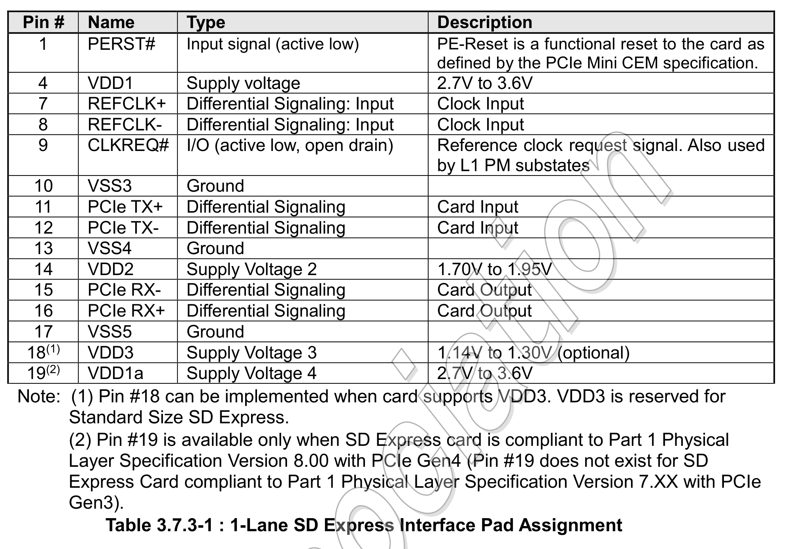
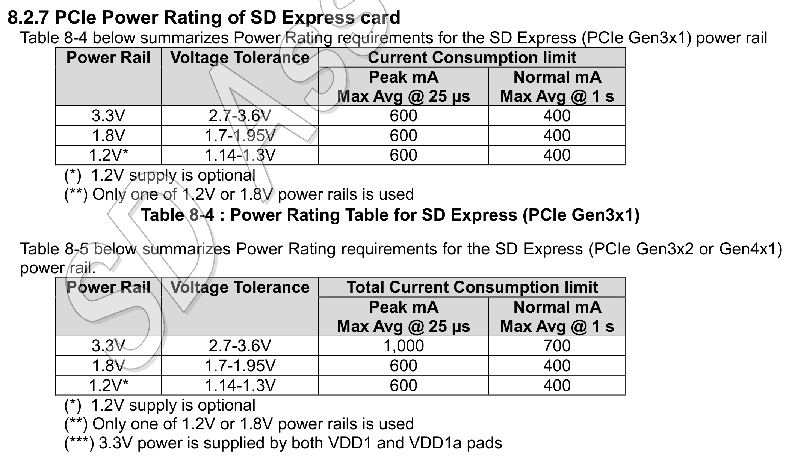
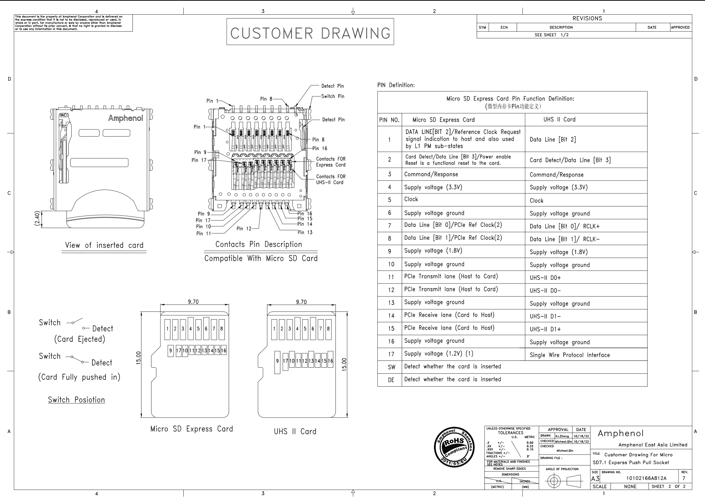
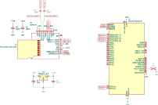
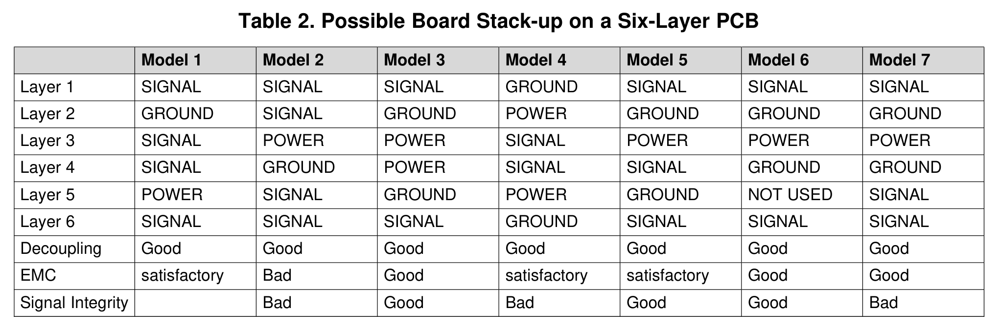

+++
date = '2025-05-15T16:33:46+02:00'
title = 'A microSD Express card in an M.2 slot'
ShowToc = true
+++

The upcoming Nintendo Switch 2 game console features microSD Express cards,
which I hadn't heard about before. Since I got nothing else to do while waiting
for the console to release, I dug deeper into what these actually are.

These microSD **Express** cards have additional pins for ... 🥁 ... PCI Express.
This allows transferring data much faster compared to their SDIO interface. So I
went looking online for adapters, which can connect these cards to a computers
PCIe port. To my surprise, these don't exist. Heck, even for USB, there's only a
single adapter that you can buy: `SanDisk PRO-READER SD Express Dual Card`.
There are a couple more for full-sized SD cards, but SD<->microSD adapters don't
seem to exist, which makes them useless to me.

I could have just stopped here, because I don't really need to connect these
cards to my PC at all — let alone via PCIe. I'm a very curious person though and
this adapter can actually be very useful:

- **Speed tests**: There are multiple vendors now and that number is only gonna
  increase with a very popular system like the Switch 2 requiring them, so it
  makes sense to publish speed test comparisons so buyers can make an informed
  choice. Connecting them directly via their native interface bypasses
  limitations of USB adapters and conflicts of interest of the Sandisk adapter.
- **Verify my understanding**: I plan to build an adapter which can connect
  full-size M.2 NVMe SSDs to the Nintendo Switch 2. This is more complicated and
  expensive though, and building a simple adapter in the other direction is a
  great way to start small and experiment.
- **Price**: In theory this should be way cheaper than the overpriced Sandisk
  reader. That didn't turn out to be true, because I greatly underestimated the
  complexity of the PCB — more on that later. Additionally, a PCIe based adapter
  is less practical because most computers don't support PCIe hotplug so you
  have to restart every time you want to connect another card.

With that, I had enough random reasons to justify spending time and money on
something that I don't really need 🙈.

# The microSD Express Pinout

You'd think that this is very easy to figure out, but it was almost impossible.
The SD specifications are only available to members of the SD Association and
since SD Express is very unpopular, there isn't really any public information
about them. The SD Association was actually kind enough to publish a
[redacted version of the specification](https://www.sdcard.org/downloads/pls/pdf/?p=Part1_Physical_Layer_Simplified_Specification_Ver9.10.jpg&f=Part1PhysicalLayerSimplifiedSpecificationVer9.10Fin_20231201.pdf&e=EN_SS9_1).
It does actually contain the pinout of full-size SD cards for SDIO, UFS and
Express. But almost everything related to microSD cards was put into a separate,
non-public document 😱.

But with the SD Express pinout I at least knew which signals there are:


Pins 1-9 are just the standard SDIO pins, which non-Express cards have as well.
They left out the ones which are not used in PCIe mode. Some of these SDIO pins
being used in PCIe mode means that both the card and the host need to do
multiplexing. That's not important for the adapter which is the focus of this
blog post, but that'll become very important for a different project.

Other parts of the same document explain that simply connecting VDD2(1.8V) will
put the card into PCIe mode, which is exactly what we want 🎰. Additionally, we
can see that aside from VSS and VDD pins, we have:

- REFCLK +/-
- PCIe TX +/- (host to card)
- PCIe RX +/- (card to host)
- PERST#
- CLKREQ#

# The PCI Express Pinout

The PCIe specifications are also not available publicly, but since it's very
widespread, you can find everything you want to know online. Thanks to
[pinoutguide.com](https://pinoutguide.com/Slots/pci_express_pinout.shtml), we
know the pinout of a 1x PCIe connector. The relevant signals are:

- REFCLK +/-
- PCIe TX +/-
- PCIe RX +/-
- PERST#
- +3.3V

Note the absence of the CLKREQ# signal. I don't know if it's really required,
but I was looking at the pinout of M.2 M-key slots which are used by SSDs and
they do have this signal. I figured that I have more devices with M.2 slots than
PCIe slots anyway, so I decided to build an M.2 adapter instead.

# Bill Of Materials (BOM)

At this point I at least knew how it would work electrically, which components
would I have to put on my M.2 card?

## microSD Express Socket

Search forms of online shops like Digikey proved to be completely useless for
this endeavor. They don't have any express option in their filters and their
searches returned either nothing or a ton of standard microSD sockets. Luckily,
Google found what I believe to be the only microSD Express socket manufacturer
in existence: Amphenol. They have a
[3-in-1 socket](https://www.amphenol-cs.com/product/10102166a812a.html)
which supports UHS-I, UHS-2 and Express. And, lo and behold, it's available on
DigiKey 🎉.

## AC Coupling Capacitors

The simplified SD specification mentions that the PCIe lane used by the card
for sending needs capacitors. Normal PCIe devices integrate these, but microSD
cards have external ones due to space constraints. But they have to be as close
to the card as possible. Most guides recommend 200nF, so I used that.

## 1.8V LDO

M.2 slots offer 3.3V only. There is a VIO_1.8V signal, but it's not meant to
power a device. But that's fine, all I need is an LDO. I chose the AMS1117-1.8
because it supports an output current of 1A or 1.8W, which is way above the
allowed 600mA:


This LDO also needs two capacitors, but that's simple enough.


**And that's actually all the components we need 🤯. I guess that shouldn't
surprise me that much, since we're literally just connecting a PCIe device with
a weird connector to an M.2 slot.**

# Back To The microSD Express Pinout

You might have noticed that I have only mentioned the SD Express pinout so far.
Completely ignoring that I need the microSD pinout, which I couldn't find
anywhere on the internet. Well, the product drawing of the microSD Express
connector actually has a surprise in it:



- **1**: CLKREQ#
- **2**: PERST#
- **3-6**: Unchanged from SDIO mode
- **7,8**: REFCLK +/-
- **9**: 1.8V
- **10,13,16**: GND
- **11,12**: PCIe_TX +/- (host to card)
- **14,15**: PCIe_RX -/+ (card to host)
- **17**: 1.2V. This is optional and I won't connect it.

The drawing doesn't actually tell us which differential line is + and which one
is -. Luckily, there is a second column for the UFS-II signals, which allowed me
to compare that against the full-size SD pinouts to figure that out. Note that
PCIe_RX is -/+, which is not a typo.

# M.2 Connector

The M.2 socket symbol in KiCad links to the M.2 specification hosted on pudn,
which was incredibly helpful to understand both the mechanics and the signals
of both the socket and the card.

Thanks to the GitHub user adryzz, there's already a ready-to-use
[M.2 Key-E footprint](https://github.com/adryzz/M.2-Key-E-Footprints) for KiCad.
Originally I actually intended to build a Key-E card simply due to this being
available and being unable to find a Key-M footprint. I decided to bite the
bullet and turn it into Key-M based on their work for several reasons:

- There are reports of mainboards rejecting SSDs connected to a Key-E slot.
- Key-M is way more common. I have a USB-to-M.2 adapter, which I could use
  with my adapter to be able to hotplug these cards. I won't use this for my
  speedtests but it can be useful.
- Most Key-M slots are 80mm long, which makes it easier to fit all components on
  it. You'd think that I won't need that much space for a tiny microSD card, but
  I actually do. You'll see why in the PCB layout section.

So I went to turn adryzzs Key-E into a Key-M and did actually find a (minor?)
difference between their design and the specification: The pins on the back are
supposed to be longer than on the front (2.5mm total). That was an easy fix
though.

# Schematics

Simple and straightforward. The VIO_CFG can be used to select between 1.8V and
3.3V for IO signals. Both sides need to be at least tolerant of both voltages.
I shouldn't need this resistor, but it might be useful, so I added it as a
"Do Not Place" component.



# PCB Layout

This is where things get hairy. _Did I mention that I'm not an electrical
engineer? Did I mention that I've only created 3 very simple PCBs in my life?
Did you know that high-frequency signals like PCIe need very careful routing and
even fine-tuning in cooperation with the PCB manufacturer?_ I certainly didn't
when I started this project. I was actually close to giving up on this whole
project.
I thought: `I just have to connect all these pins 1:1. How hard could that be?`.

## The bad news

Some googling quickly revealed that there are a ton of things you have to take
care of to make sure that the PCIe signal goes through without major
interference. Luckily, I found several documents from Texas Instruments which
offer very practical tips and techniques without the need for a physics degree.
For me, the single most useful document was
[High-Speed Layout Guidelines for Signal Conditioners and USB Hubs](https://www.ti.com/lit/an/slla414/slla414.pdf).

## Length matching

This is an easy one, but I think it's important to mention. If you transfer data
via multiple signals (like 4-bit SDIO), you usually have to make sure that all
of the traces have the same length to make sure they all arrive at the same
time. Luckily, PCIe does NOT need length matching between TX, RX and REFCLK.
You only need that for the +/- pairs individually. This is called skew.

## Impedance

This is the one which almost made me cancel the project. I think my biggest
mistake was trying to calculate the correct trace width using KiCad's impedance
calculator. It needs a ton of input parameters and I had no idea what their
values should be. Multiple hours of research made me more frustrated, not any
smarter.

I went to bed and the next morning I gave it another try. I found out, that the
PCB manufacturer I want to order from (JLCPCB) has a very simple calculator
where you just enter the following parameters:

- Number of layers in the PCB
- PCB thickness
- Inner copper weight
- Outer copper weight
- Impedance
- Signal type
- Signal layer and which layers are above/below it.

And then it just tells you which trace width and spacing your traces need to
achieve the given impedance. The TI document tells us that PCIe needs an
impedance of 85Ω, the signal type is `Differential Pair (Non coplanar)` and the
other parameters are just normal PCB properties which you can choose however you
want. For JLCPCB I just use the most common copper weight because they are the
cheapest. I need to use a 0.8mm thick PCB because that's given by the M.2
specification.

Finally, I got back my hope that I'll be able to create a working PCB ☀️.

Later, I looked at other trace impedance calculators like the one from DigiKey
and ... wait what? It's actually that simple? Yea it turns out, that most of the
input parameters of KiCad's calculator have zero effect on the differential
impedance and are just used to calculate additional effects like losses 🤦.

**And that's how I was able to calculate and match impedance for my PCB without
actually understanding what it is 🙈.**

## Layer Stackup

The TI document recommends at least 6 layers and has this useful table:


Since I lack the knowledge to make an informed decision, I simply chose the only
model where Decoupling, EMC and Signal integrity say `Good`: Model 3.

## PCB Fiber Weave

TIs [High-Speed Interface Layout Guidelines](https://www.ti.com/lit/an/spraar7j/spraar7j.pdf)
mention, that the PCBs fiber weave is an important consideration, too. So I
use JLCPCBs `TR4 TG155` and make sure to route as many parts of my traces at an
angle as possible.

## Component Placement

Remember microSD Express' PCIe_RX lines being swapped compared to M.2? With
differential lines you can't just cross them using vias, because that would be
really bad for signal integrity. Instead, you have to do a 180 degree turn and
connect to the pads from the other side. That means I have to connect to the
microSD pads from two sides while still complying with all of the routing
guidelines for high-speed transmission lines. After testing multiple options
for several days I could only come up with a single configuration that works:



## Non 45-degree differential traces

I have to use non 45-degree traces to shorten the long straight paths which
would be aligned with the PCB fiber weave. This was already done in the image
above. Since KiCad doesn't support free-angle routing for differential traces,
how did I do that, you may ask? Manually calculating them using trigonometry math
and placing the lines manually, duh. This was a lot of work and I don't really
want to get into the math here. I also don't ever want to do that again. I'd
rather get into KiCad's codebase to add support for this feature.

## Fillet Tracks

By default, KiCad does sharp 45-degree turns. The TI guide recommends making
them round, though to improve signal integrity. Luckily, KiCad supports
rounding existing tracks by providing a radius. Since it doesn't take care
to keep the distance between differential tracks constant, you have to apply
fillets to the outer and inner sides of a curve separately using different
radii. Thanks to KiCad forum user craftyjon for the
[hint](https://forum.kicad.info/t/can-i-trust-kicad-5-99s-fillet-function-on-my-high-speed-differential-pairs/30059/5).

## The price

Having to use a 6-layer PCB `FR-4 TG155` made this way more expensive than
JLCPCBs simple $2 PCBs. I also made the mistake of using vias with a 0.2mm hole
size for the PCIe traces which added another $20. Of course, I could have
probably changed that, but after going through all that pain, I just wanted
place the order already. So yes, I paid over $100 for 5 passive PCIe adapters
💸.

# The delivery 📦




Look at those beautiful boards. I've never ordered ENIG before, so the golden
color was new to me.

# Soldering

I would have loved to spend even more money and let JLCPCB assemble everything
for me. Unfortunately, they did not have the microSD sockets in stock, so I
ordered them from DigiKey and prepared to do that myself.

_Did I mention that I only had very basic soldering experience and had never
done reflow soldering before?_

I was REALLY scared of that process. Luckily I already owned a hot air gun and a
digital microscope, the latter of which was absolutely necessary so my bad eyes
can actually see those 1mm pitch connector pins and 0402 capacitors lol.

So I ordered [low-temperature solder paste](https://www.chipquik.com/datasheets/NC191LT10.pdf)
from DigiKey and a stencil from JLCPCB so I can apply the perfect amount of
paste to reduce the risk of shorting pins during reflow soldering. I really
don't want to have to rework these tiny pins. Of course, I forgot to include the
back side of the PCB in the stencil which would have cost the exact same, so I
had to apply paste to the 0402 AC coupling capacitors manually 🙄.

To my surprise, all of that went really well, though. The solder paste was the
perfect amount and in exactly the right places. Placing the components was not
an issue. After finding the right temperature and airflow for the heat gun, the
solder paste started to melt and all components had perfect solder joints. I
was stunned.




# The final test

So there I was, the only human on the planet with an M.2 microSD Express card
reader right in my hands. But does it work? I didn't dare to plug this into my
precious laptop yet. I inserted it without a microSD card into my USB-NVMe
adapter instead, which I then connected to an old laptop. No smoke? No smoke!
I checked the voltage of the 3.3V pin: 3.3V. I checked the voltage of the 1.8V
pin: 1.8V. I inserted my Sandisk 256GB microSD Express card aaaaaand:
Holy 🐄 it's actually working:

```bash
usbcore: registered new interface driver uas
scsi 0:0:0:0: Direct-Access     ST25671_ WDC SanDisk SD E 1.00 PQ: 0 ANSI: 6
sd 0:0:0:0: [sda] 495050752 512-byte logical blocks: (253 GB/236 GiB)
sd 0:0:0:0: [sda] Write Protect is off
sd 0:0:0:0: [sda] Mode Sense: 37 00 00 08
sd 0:0:0:0: [sda] Write cache: enabled, read cache: enabled, doesn't support DPO or FUA
sd 0:0:0:0: [sda] Preferred minimum I/O size 512 bytes
sd 0:0:0:0: [sda] Optimal transfer size 33553920 bytes
 sda: sda1
sd 0:0:0:0: [sda] Attached SCSI disk
```

That was a big surprise and a huge relief to me. After having to reverse
engineer the pinout from multiple documents, I did not expect everything to be
connected correctly, but it was 🥳. So there was only one thing left to do:
Connect it directly to my laptop. I plugged it into the M.2 slot, put in the
screw, took a deep breath and pressed the power button. I missed entering the
firmware's boot menu, so I had to wait for Linux to boot before I knew if I'm
currently cooking my motherboard chipset. I opened a terminal, entered
`nvme list` and was greeted with this victorious output:

```bash
Node                  Generic               SN                   Model                                    Namespace  Usage                      Format           FW Rev
--------------------- --------------------- -------------------- ---------------------------------------- ---------- -------------------------- ---------------- --------
/dev/nvme0n1          /dev/ng0n1            XXXXXXXXXXX000000000 ST25671_WDC SanDisk SD Express SDSQXFN   0x1        253.47  GB / 253.47  GB    512   B +  0 B   RO157S2P
```

So I did it, I actually did it. I did further tests and it's actually running
at PCIe Gen3 speed and there seem to be no issues while running a speedtest, so
the signal integrity seems to be good as well. The results of these speedtests
are the topic of the next blog post. Have a nice day.

All design files are available on
[GitHub](https://github.com/M1cha/sdexpress_pcbs/tree/main/m2_m_card-to-usdex_socket).
